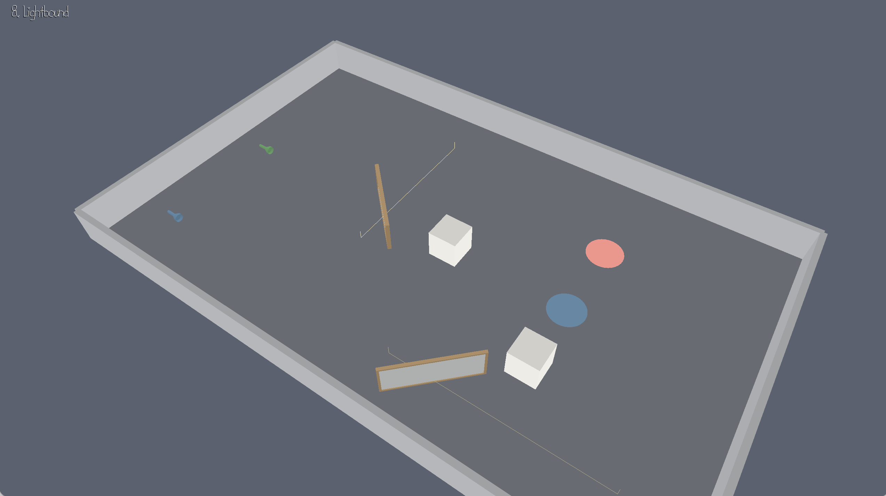

# Lightbound

Author: Shuning Liu

Design: Optical physics puzzles. Lasers charge crates, fire one face-normal shove, then crates coast and collide. Try to park a crate on the pressure pad (red → green).
Screen Shot:

How To Play:

- **Space** — start / stop the beam
- **Tab** — cycle mirrors (each is rotate **or** slide, never both)
- **Q / E** — rotate a fixed-mount mirror
- **WASD** — slide a rail mirror
- **RMB drag / wheel** — orbit / zoom
- **R** (hold) — rewind
- **Shift+R** or **Backspace** — reset
- **P / N** — previous / next level

## Extra Credit

**Deterministic?** Yes. Physics uses a fixed `dt = 1/60` accumulator; only `sim_step` advances `GameState`; controls apply once per tick; no `rand`. Camera / FPS do not write sim state.

Verify: on L1, reset, Space once, wait. Reset and repeat. Outcome matches. Orbit / resize during the wait must not change it.

**Rewindable?** Yes. Each tick copies `GameState` into a deque. Hold **R** to step backward; release to play forward from that snapshot.

Verify: on L1, Space, then hold **R** — the crate rolls back. On L5, trip the switch, then rewind until the second laser turns off.

This game was built with [NEST](NEST.md).
